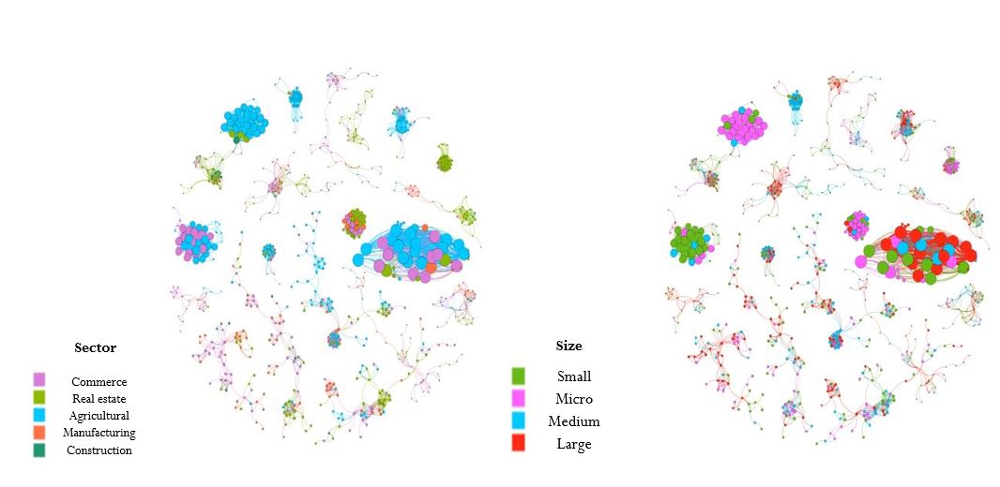

## Research Work

# Network of Shared Administrators and their Relationship with Financial Performance in Companies of Ecuador: What is the effect of sharing Human Capital?

# ABSTRACT

Information has always been a potential source of comparative advantage between companies, so knowing it in its entirety has become a necessity for decision makers. Today, there are tools such as Social Network Analysis, which may have a greater scope to know the impact of relationships between individuals. In this project, the effect of financial performance on sharing human capital and being a prominent company in the market is quantified. Likewise, communities in the industry were identified, using modularity as a measure of grouping between companies. With a sample of 9,070 signatures from Ecuador in 2018, indicators were proposed based on the history of administrators and the centrality measures of the graph theory. Income was chosen as the indicator that best represents financial performance. The results found showed that there is a considerable positive effect on financial performance when a company is prominent in the market. On the other hand, it is determined that there is a negative effect on financial performance by sharing human capital, when hiring a worker who works or worked in a company in the same sector, as well as in other sectors of the industry. Finally, it was found that the indicators that quantify connections with companies represent a valuable source of information for firms. 

For the detection of communities through the modularity of a graph, the Louvain algorithm was used. Using this tool, 3,146 communities formed from 1 to 69 companies were found.
Due to the large number of communities, the first 20 clusters containing the largest number of companies were chosen. These communities contained 722 companies that represent 7.96% of the total companies and within each community there were more than 20 companies.

In the figures that were made, the magnitude or size of each node is given by the value of the indicator eigen centrality. Figure 1 shows a general graph with the 20 communities, and the color of each node represents the community to which each company belongs.
In the case of the 20 communities with the highest number of companies, 2 additional graphs were made according to the sector and size of the companies. In figure 2, the color represents both the size of each company and the sector to which it belongs.

### Figure 1

### Figure 2 

